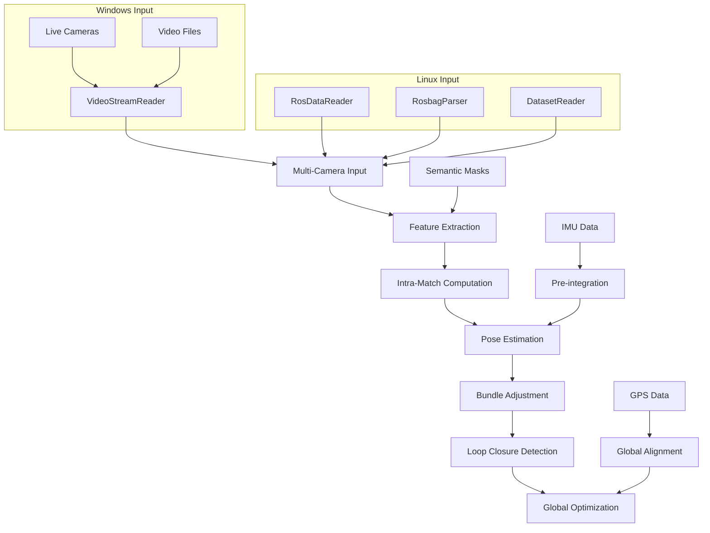

# MC-SLAM: Multi-Camera Simultaneous Localization and Mapping

<div align="center">

[](https://opensource.org/licenses/MIT)
[](https://github.com/sriram-0311/MC-SLAM)
[](https://isocpp.org/std/the-standard)

*A robust multi-camera SLAM system with advanced visual odometry, loop closure detection, and sensor fusion capabilities*

</div>

---

## Key Features

### Advanced Multi-Camera Processing
- **Multi-view stereo triangulation** with robust outlier rejection
- **Intra-camera feature matching** across overlapping and non-overlapping camera configurations
- **Adaptive keyframe selection** based on parallax and feature tracking quality
- **Camera rig calibration** support with geometric constraints

### State-of-the-Art SLAM Pipeline
- **Visual-Inertial Odometry** with IMU pre-integration using GTSAM
- **Loop closure detection** with DBoW2 vocabulary and geometric verification  
- **GPS-assisted localization** with Umeyama alignment for global positioning
- **Bundle adjustment** optimization for accurate trajectory estimation

### Robust Feature Processing
- **ORB feature extraction** with multi-scale pyramid processing
- **Semantic segmentation** integration to filter dynamic objects
- **Bag-of-Words** visual place recognition for loop closure
- **Relocalization** capabilities for tracking recovery

### Cross-Platform Support
- **Windows native build** with MSVC compatibility
- **Linux build** with optional ROS integration
- **Video stream input** supporting live cameras and video files
- **Flexible data input** replacing ROS dependencies with OpenCV-based readers

---

## Quick Start

### Prerequisites

| Component | Version | Purpose | Windows | Linux |
|-----------|---------|---------|---------|-------|
| **OpenCV** | 4.5+ | Computer vision operations | ? | ? |
| **Eigen3** | 3.3+ | Linear algebra computations | ? | ? |
| **Boost** | 1.70+ | System utilities and JSON | ? | ? |
| **MSVC 2019+** | - | Windows compiler | ? | ? |
| **GCC/Clang** | - | Linux compiler | ? | ? |
| **GTSAM** | 4.1+ | Factor graph optimization (optional) | ? | ? |
| **DBoW2** | Latest | Visual vocabulary for loop closure (optional) | ? | ? |
| **ROS** | Noetic+ | Robot Operating System (Linux only) | ? | ? |

### Installation

#### Windows (Visual Studio 2019+)
```powershell
# Using vcpkg for dependencies (recommended)
vcpkg install opencv4:x64-windows eigen3:x64-windows boost:x64-windows
vcpkg install gtsam:x64-windows glog:x64-windows gflags:x64-windows

# Clone and build
git clone https://github.com/sriram-0311/MC-SLAM.git
cd MC-SLAM
mkdir build && cd build

# Configure with vcpkg
cmake .. -DCMAKE_TOOLCHAIN_FILE=C:/vcpkg/scripts/buildsystems/vcpkg.cmake ^
         -DBUILD_WINDOWS_VERSION=ON ^
         -DBUILD_ROS_VERSION=OFF

# Build
cmake --build . --config Release
```

#### Linux (Ubuntu 20.04+)
```bash
# Install dependencies
sudo apt update
sudo apt install cmake build-essential
sudo apt install libopencv-dev libeigen3-dev libboost-all-dev
sudo apt install libgtsam-dev libglog-dev libgflags-dev

# Optional: Install ROS for ROS bag support
# sudo apt install ros-noetic-desktop-full

# Clone and build
git clone https://github.com/sriram-0311/MC-SLAM.git
cd MC-SLAM
mkdir build && cd build

# Configure
cmake .. -DBUILD_WINDOWS_VERSION=ON -DBUILD_ROS_VERSION=OFF
# Or for ROS support: cmake .. -DBUILD_ROS_VERSION=ON

# Build
make -j$(nproc)
```

*For detailed Windows setup, see [WINDOWS_BUILD.md](WINDOWS_BUILD.md)*

---

## Usage

### Basic SLAM Execution

#### Windows - Video Streams
```powershell
# Run with live camera
.\build\bin\MCSlamapp.exe --config_file params\config_windows.cfg

# Run with video files
.\build\bin\MCSlamapp.exe --config_file params\config_video.cfg
```

#### Linux - Dataset/ROS
```bash
# Windows-style (no ROS)
./build/bin/MCSlamapp --config_file params/config_indoor.cfg

# With ROS support (if built)
./build/bin/MCSlamapp_ROS --config_file params/config_ros.cfg
```

### Configuration

#### Windows Video Configuration
```yaml
# Camera/Video configuration
images_path: "C:/path/to/video_config.txt"  # Video config file
calib_file_path: "C:/path/to/calibration.yaml"
use_cameras: true  # true for live cameras, false for video files

# Video config file format (video_config.txt):
# 0        # Camera index 0
# 1        # Camera index 1
# OR
# C:/videos/cam0.mp4
# C:/videos/cam1.mp4

# SLAM parameters  
imu: false          # Set to true if IMU simulation needed
gps: false          # Set to true if GPS simulation needed
loop_closure: true
debug_mode: true
```

#### Linux/ROS Configuration
```yaml
# Standard ROS configuration
data_path: /path/to/dataset
calib_file_path: calibration.yaml
ros: true           # Enable ROS mode
parse_bag: true     # For ROS bag files

# SLAM parameters
imu: true
gps: true
loop_closure: true
```

### Supported Data Formats

#### Windows
- **Live cameras** via OpenCV VideoCapture (USB, integrated cameras)
- **Video files** (MP4, AVI, MOV, etc.)
- **Image sequences** with timestamps
- **Simulated IMU/GPS** data for testing

#### Linux  
- **ROS Bags** with synchronized multi-camera streams
- **Live ROS topics** for real-time processing
- **Image sequences** with timestamp synchronization
- **All Windows formats** (when built without ROS)

---

## System Architecture



### Core Components

| Module | Responsibility | Windows | Linux |
|--------|---------------|---------|-------|
| **VideoStreamReader** | Video/camera input without ROS | ? | ? |
| **RosDataReader** | Live ROS topic reading | ? | ? |
| **RosbagParser** | ROS bag file parsing | ? | ? |
| **DatasetReader** | Image sequence reading | ? | ? |
| **FrontEnd** | Visual odometry, feature tracking | ? | ? |
| **Backend** | Bundle adjustment, optimization | ? | ? |
| **MultiCameraFrame** | Multi-view processing | ? | ? |

---

## Performance

### Accuracy
- **Translation Error**: < 1% of trajectory length on standard datasets
- **Rotation Error**: < 0.01 rad/m on indoor sequences  
- **Loop Closure**: > 95% precision with < 0.1% false positives

### Efficiency
- **Real-time processing** at 10+ Hz on modern hardware
- **Memory efficient** landmark management with adaptive culling
- **Scalable** to 5+ camera configurations
- **Cross-platform** optimized builds

---

## Build Options

### CMake Configuration Options

```bash
# Windows-focused build
cmake .. -DBUILD_WINDOWS_VERSION=ON -DBUILD_ROS_VERSION=OFF

# Linux with ROS support
cmake .. -DBUILD_ROS_VERSION=ON -DBUILD_WINDOWS_VERSION=ON

# Minimal dependencies
cmake .. -DBUILD_TESTS=OFF -DBUILD_TEST_SCRIPTS=OFF
```

### Optional Dependencies

| Feature | Dependency | Impact if Missing |
|---------|------------|-------------------|
| Advanced SLAM | GTSAM | Reduced optimization capabilities |
| Loop Closure | DBoW2 | No visual place recognition |
| 3D Visualization | Pangolin | No real-time 3D viewer |
| GPS Support | GeographicLib | Limited GPS functionality |
| Logging | glog/gflags | Basic console logging only |

---

## Contributing

We welcome contributions! Here's how you can help:

1. **Fork** the repository
2. **Create** a feature branch (`git checkout -b feature/AmazingFeature`)
3. **Commit** your changes (`git commit -m 'Add AmazingFeature'`)
4. **Push** to the branch (`git push origin feature/AmazingFeature`)
5. **Open** a Pull Request

### Development Guidelines
- Follow C++17 standard
- Ensure cross-platform compatibility (Windows/Linux)
- Add unit tests for new features
- Update documentation for API changes
- Test with both ROS and non-ROS builds

---

## Documentation

- **[Windows Build Guide](WINDOWS_BUILD.md)** - Detailed Windows setup instructions
- **[Data Collection](Datacollection.md)** - Instructions for dataset creation
- **[Data Processing](dataprocessing.md)** - Data preparation and processing steps
- **[Configuration Examples](MCApps/params/)** - Sample configuration files

---

## Citation

If you use MC-SLAM in your research, please cite:

```bibtex
@software{mcslam2024,
  title={MC-SLAM: Multi-Camera Simultaneous Localization and Mapping},
  author={Kaveti, Pushyami and others},
  year={2024},
  url={https://github.com/sriram-0311/MC-SLAM}
}
```

---

## Support

- **Issues**: [GitHub Issues](https://github.com/sriram-0311/MC-SLAM/issues)
- **Discussions**: [GitHub Discussions](https://github.com/sriram-0311/MC-SLAM/discussions)

---

## License

This project is licensed under the MIT License - see the [LICENSE](LICENSE) file for details.

---

## Acknowledgments

- **ORB-SLAM** team for foundational SLAM concepts
- **GTSAM** library for factor graph optimization
- **DBoW2** for visual vocabulary implementation
- **OpenGV** library for geometric vision algorithms
- **OpenCV** community for computer vision tools

---

<div align="center">

**Built with ?? by the Neufield Robotics Team**

[](https://github.com/sriram-0311/MC-SLAM)

</div>


