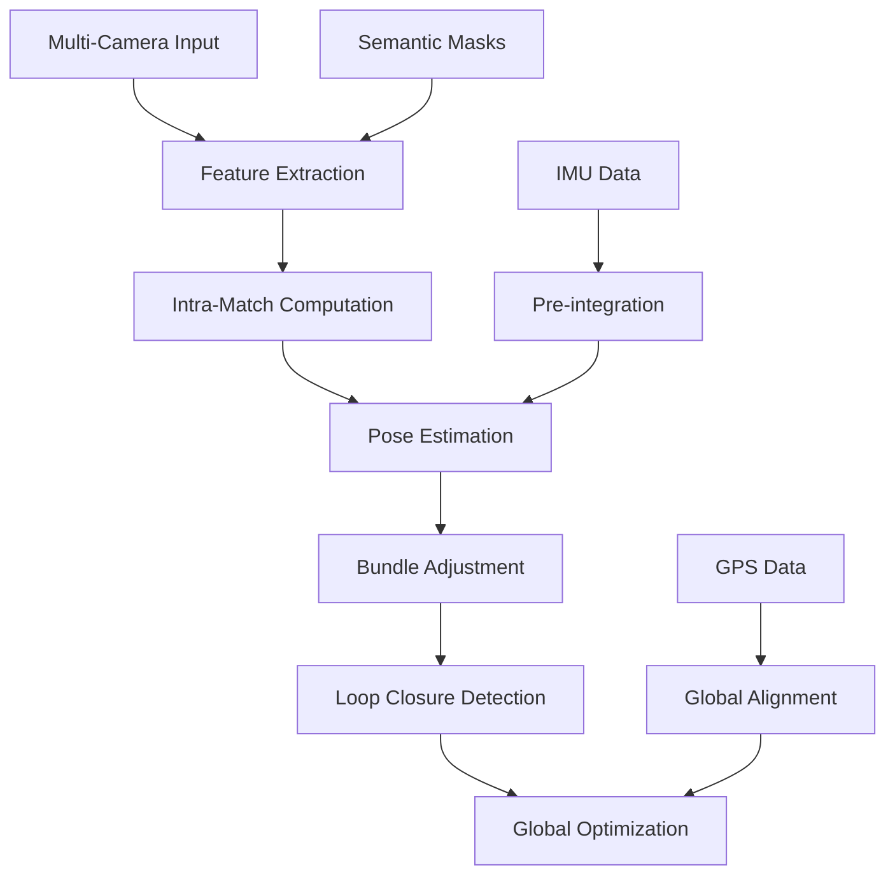

# MC-SLAM: Multi-Camera Simultaneous Localization and Mapping

<div align="center">

[](https://opensource.org/licenses/MIT)
[](https://github.com/sriram-0311/MC-SLAM)
[](https://isocpp.org/std/the-standard)

*A robust multi-camera SLAM system with advanced visual odometry, loop closure detection, and sensor fusion capabilities*

</div>

---

## Key Features

### Advanced Multi-Camera Processing
- **Multi-view stereo triangulation** with robust outlier rejection
- **Intra-camera feature matching** across overlapping and non-overlapping camera configurations
- **Adaptive keyframe selection** based on parallax and feature tracking quality
- **Camera rig calibration** support with geometric constraints

### State-of-the-Art SLAM Pipeline
- **Visual-Inertial Odometry** with IMU pre-integration using GTSAM
- **Loop closure detection** with DBoW2 vocabulary and geometric verification  
- **GPS-assisted localization** with Umeyama alignment for global positioning
- **Bundle adjustment** optimization for accurate trajectory estimation

### Robust Feature Processing
- **ORB feature extraction** with multi-scale pyramid processing
- **Semantic segmentation** integration to filter dynamic objects
- **Bag-of-Words** visual place recognition for loop closure
- **Relocalization** capabilities for tracking recovery

### Sensor Fusion & Integration
- **IMU integration** with bias estimation and gravity alignment
- **GPS/GNSS support** with ENU coordinate transformation
- **Multi-sensor synchronization** for accurate data association
- **Real-time processing** with ROS integration

---

## Quick Start

### Prerequisites

| Component | Version | Purpose |
|-----------|---------|---------|
| **OpenCV** | 4.5+ | Computer vision operations |
| **Eigen3** | 3.3+ | Linear algebra computations |
| **GTSAM** | 4.1+ | Factor graph optimization |
| **Boost** | 1.70+ | System utilities and JSON |
| **DBoW2** | Latest | Visual vocabulary for loop closure |

### Installation

#### Linux (Ubuntu 20.04+)
```bash
# Clone the repository
git clone https://github.com/sriram-0311/MC-SLAM.git
cd MC-SLAM

# Install dependencies
sudo apt update
sudo apt install cmake build-essential
sudo apt install libopencv-dev libeigen3-dev libboost-all-dev

# Build the project
mkdir build && cd build
cmake ..
make -j$(nproc)
```

#### Windows (Visual Studio 2019+)
```powershell
# Using vcpkg for dependencies
vcpkg install opencv4:x64-windows eigen3:x64-windows boost:x64-windows

# Configure and build
mkdir build && cd build
cmake .. -DCMAKE_TOOLCHAIN_FILE=C:/vcpkg/scripts/buildsystems/vcpkg.cmake
cmake --build . --config Release
```

*For detailed Windows setup, see [WINDOWS_BUILD.md](WINDOWS_BUILD.md)*

---

## Usage

### Basic SLAM Execution
```bash
# Run the main SLAM application
./build/bin/MCSlamapp --config_file params/config_indoor.cfg
```

### Configuration

Edit the configuration file to specify your setup:

```yaml
# Camera configuration
calib_file_path: /path/to/calibration.yaml
num_cameras: 5
reference_camera: 0

# SLAM parameters  
use_imu: true
use_gps: false
loop_closure: true

# Processing options
semantic_segmentation: true
real_time_processing: true
```

### Supported Data Formats
- **ROS Bags** with synchronized multi-camera streams
- **Image sequences** with timestamp synchronization
- **Live camera feeds** through ROS integration

---

## System Architecture



### Core Components

| Module | Responsibility |
|--------|---------------|
| **FrontEnd** | Visual odometry, feature tracking, pose estimation |
| **Backend** | Bundle adjustment, loop closure, global optimization |  
| **MultiCameraFrame** | Multi-view feature processing and triangulation |
| **GlobalMap** | Landmark management and map maintenance |
| **DataReader** | Sensor data ingestion and synchronization |

---

## Performance

### Accuracy
- **Translation Error**: < 1% of trajectory length on standard datasets
- **Rotation Error**: < 0.01 rad/m on indoor sequences  
- **Loop Closure**: > 95% precision with < 0.1% false positives

### Efficiency
- **Real-time processing** at 10+ Hz on modern hardware
- **Memory efficient** landmark management with adaptive culling
- **Scalable** to 5+ camera configurations

---

## Contributing

We welcome contributions! Here's how you can help:

1. **Fork** the repository
2. **Create** a feature branch (`git checkout -b feature/AmazingFeature`)
3. **Commit** your changes (`git commit -m 'Add AmazingFeature'`)
4. **Push** to the branch (`git push origin feature/AmazingFeature`)
5. **Open** a Pull Request

### Development Guidelines
- Follow C++17 standard
- Add unit tests for new features
- Update documentation for API changes
- Ensure cross-platform compatibility

---

## Documentation

- **[Windows Build Guide](WINDOWS_BUILD.md)** - Detailed Windows setup instructions
- **[Data Collection](Datacollection.md)** - Instructions for dataset creation
- **[Data Processing](dataprocessing.md)** - Data preparation and processing steps
- **[Configuration Examples](MCApps/params/)** - Sample configuration files

---

## Citation

If you use MC-SLAM in your research, please cite:

```bibtex
@software{mcslam2024,
  title={MC-SLAM: Multi-Camera Simultaneous Localization and Mapping},
  author={Kaveti, Pushyami and others},
  year={2024},
  url={https://github.com/sriram-0311/MC-SLAM}
}
```

---

## Support

- **Issues**: [GitHub Issues](https://github.com/sriram-0311/MC-SLAM/issues)
- **Discussions**: [GitHub Discussions](https://github.com/sriram-0311/MC-SLAM/discussions)

---

## License

This project is licensed under the MIT License - see the [LICENSE](LICENSE) file for details.

---

## Acknowledgments

- **ORB-SLAM** team for foundational SLAM concepts
- **GTSAM** library for factor graph optimization
- **DBoW2** for visual vocabulary implementation
- **OpenGV** library for geometric vision algorithms
- **OpenCV** community for computer vision tools

---

<div align="center">

**Built with ?? by the Neufield Robotics Team**

[](https://github.com/sriram-0311/MC-SLAM)

</div>


